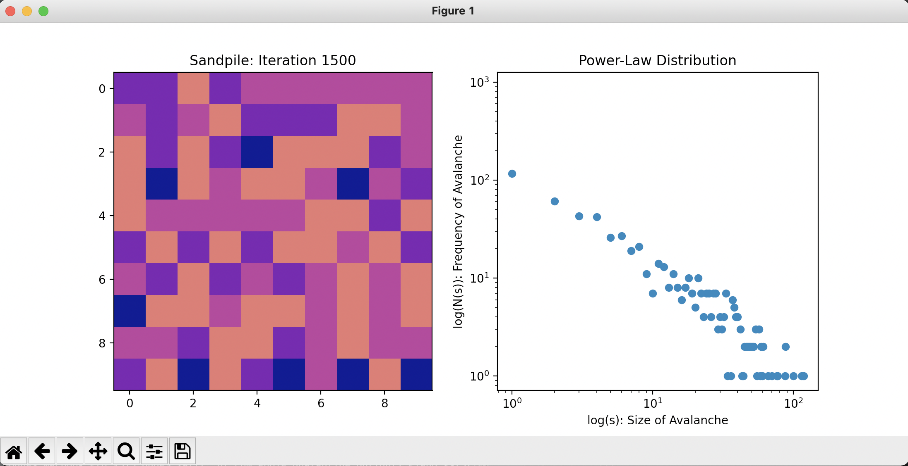
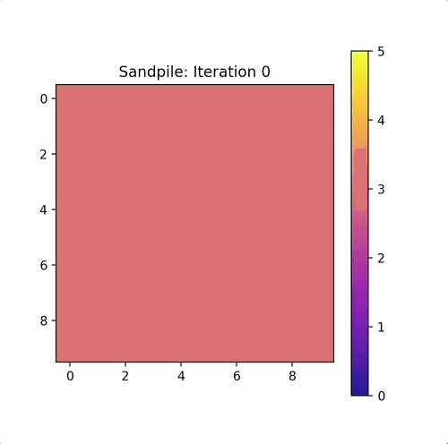

# sandpile-model-soc
A Sandpile Model Simulation in Python to demonstrate Self Ordered Criticality!

 ---

## About

This program is based off the 2018 paper ***Self-organized criticality and pattern emergence through the lens of tropical geometry*** by ***Kalinin et. al***.

This Sandpile Model Simulation is aimed to demonstrate Self Organised Criticality (SOC) which is a natural re-occurring phenomena. It can be found in the human brain, neural networks, forest fires, proteins, power grids and sandpiles!

SOC is found in dynamical systems that have power-law distributed 'avalanche sizes'... which means the number of moves or size of activity to make the system return from an unstable to a stable internal state after an external input follows a power-law distribution.

Due to the implications and applications of SOC has into neuroscience and computing it has come up in my studies. See this ***2020 article by Zimmern*** on how SOC can support optimal processing in Neural Networks and its many other benefits - ***Why Brain Criticality Is Clinically Relevant: A Scoping Review***.

---

## Example Output



**The live version looks much better!**



---

## Usage

##### (**Optional**) Modify the Sandpile Model Parameters in the file **sand_soc.py**

- **N:** number of rows in sand array
- **M:** number of coloumns in sand array
- **T:** number of iterations
- **randomise_drop:** if False, drops in center
- **starting_height:** starting amount of sand per point
- **filename:** filename to load and/or save data
- **extra_prints:** if True prints sand state and iteration data to terminal
- **cmap:** colourmap of plot
- **clim:** upper limit for colourmap
- **print_pause:** time to pause between updating plots

##### Run the program with the command

```
$ python3 sand_soc.py
```
